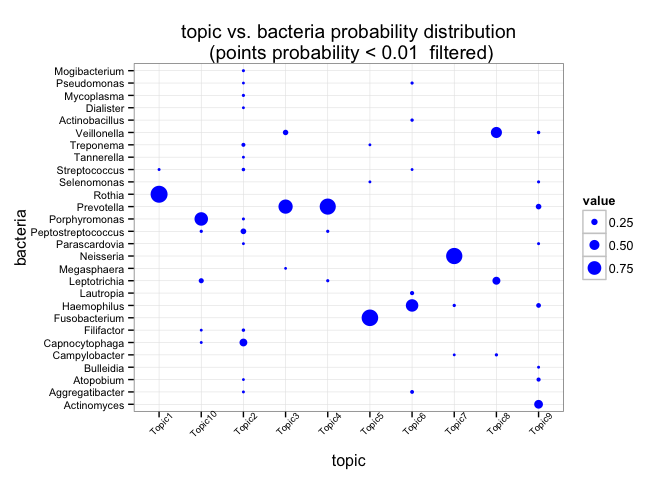
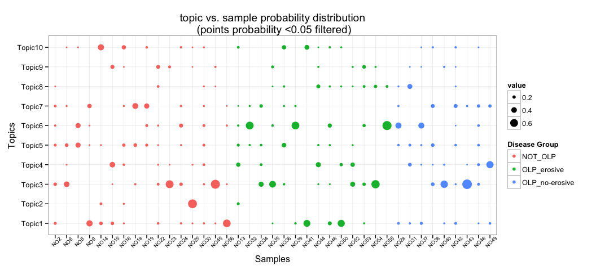
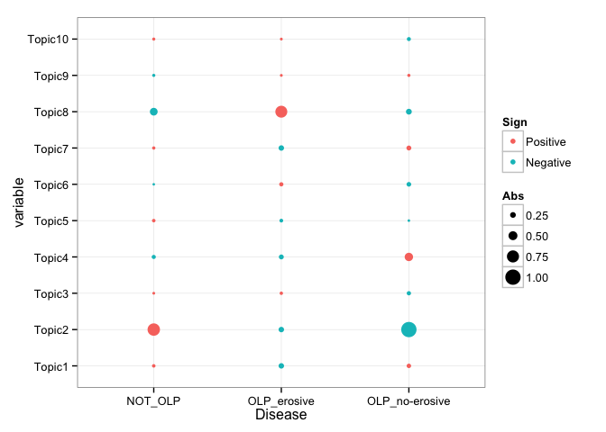

# Metatopics
- This package applies topic model to metagenomic data in order to estimate the connections among microbial. Each topics could be viewed as a latent sub-community of the microbial. Here is the data from oral microbial of 39 samples. They can be grouped by **NOT_OLP** and two OLP disease types - **OLP_BW** and **OLP_CXML**. The relationship between topics and diseases is another important issue which might help us to comprehend the disease OLP.


```r
library(metatopics)
```
- The data **meta_counts** is a matrix containing the counts of the microbial in each individual mapped to a certain microbiome. The data **genus_2_phylum** is a data frame containing the annotation for the microbial in data meta_counts.

```r
dim(meta_counts)
```

```
## [1]  39 129
```

```r
colnames(meta_counts)[1:10]
```

```
##  [1] "Abiotrophia"     "Acholeplasma"    "Achromobacter"  
##  [4] "Acidaminococcus" "Acidovorax"      "Acinetobacter"  
##  [7] "Actinobacillus"  "Actinomyces"     "Aggregatibacter"
## [10] "Alloscardovia"
```

```r
head(genus_2_phylum)
```

```
##                           genus         phylum presence    colour
## Abiotrophia         Abiotrophia     Firmicutes        1    grey66
## Acholeplasma       Acholeplasma           <NA>        0 orangered
## Achromobacter     Achromobacter Proteobacteria        1    gray46
## Acidaminococcus Acidaminococcus           <NA>        0 orangered
## Acidovorax           Acidovorax           <NA>        0 orangered
## Acinetobacter     Acinetobacter Proteobacteria        1    gray46
```
The column phylum has the corresponding phylum level annotation for each microbiome. The column colour is used for abundance.plot as an identification of the phylum level.
This data has 39 samples and the data **lls** has the disease type annotation for each sample.

```r
rownames(meta_counts)
```

```
##  [1] "NO2"  "NO6"  "NO8"  "NO9"  "NO13" "NO14" "NO15" "NO16" "NO18" "NO19"
## [11] "NO22" "NO23" "NO24" "NO25" "NO28" "NO30" "NO31" "NO32" "NO34" "NO35"
## [21] "NO36" "NO37" "NO38" "NO39" "NO40" "NO41" "NO42" "NO43" "NO44" "NO45"
## [31] "NO46" "NO48" "NO49" "NO50" "NO52" "NO53" "NO54" "NO55" "NO56"
```

```r
table(lls)
```

```
## lls
##  NOT_OLP   OLP_BW OLP_CXML 
##       16        9       14
```

You can explore the abundance of the data:

```r
  meta_abundance <- micro.abundance(meta_counts,1)
	genus_2_phylum=genus_2_phylum[colnames(meta_abundance),]
	abundance.plot(meta_abundance,classification = genus_2_phylum$phylum,col=genus_2_phylum$colour)
```

 

- In order to use topic model, some odd samples and microbial need to be filtered. You can use the function **noise.removal** in package **BiotypeR** to do this.

```r
library(BiotypeR)
```

```
## Loading required package: ade4
## Loading required package: fpc
## Loading required package: clusterSim
## Loading required package: cluster
## Loading required package: MASS
```

```r
data.denoized=noise.removal(t(meta_counts), percent=0.01)
samples=colnames(data.denoized)
bacteria=rownames(data.denoized)
data.final=meta_counts[samples,bacteria]
dim(data.final)
```

```
## [1] 39 88
```
The final data has 39 samples and 88 microbial.
- After the final data formated, you can use cross validation to find the appropriate topic number for topic model. The function **selectK** could be used to do this and the function **plot_perplexity** could help to visualize the returned perplexity and likelihood.

```r
library(slam)
library(topicmodels)
	dtm=as.simple_triplet_matrix(data.final)
	seed_num=2014
	fold_num=5
	kv_num = c(2:30)
	sp=smp(cross=fold_num,n=nrow(dtm),seed=seed_num)
	control = list(seed = seed_num, burnin = 1000,thin = 100, iter = 1000)
	#not run: system.time((ctmK=selectK(dtm=dtm,kv=kv_num,SEED=seed_num,cross=fold_num,sp=sp,method='Gibbs',control=control)))
	#not run: plot_perplexity(ctmK,kv_num)
```
－ If you have the topic number, function **LDA** in package **topicmodels** can be used to build the model.Here is an example with the topic number 10.

```r
Gibbs_model_example = LDA(dtm, k = 10, method = "Gibbs",
            control = list(seed = seed_num, burnin = 1000,thin = 100, iter = 1000))
```
- The returned model is a S4 Object. The element **beta** in the model has the estimation of the probability of each microbiome in each topic.

```r
dim(Gibbs_model_example@beta)
```

```
## [1] 10 88
```

```r
apply(exp(Gibbs_model_example@beta),1,sum)
```

```
##  [1] 1 1 1 1 1 1 1 1 1 1
```
The function **plot_beta** is a visualization method to view this matrix.This plot is based on ggplot2. The parameter *prob* is a cutoff used to restrict the number of points on the plots. If a microbiome has a probability smaller than the cutoff in a topic, it will not be shown in this topic.

```r
library(ggplot2)
plot_beta(Gibbs_model_example,prob=0.01)
```

```
## Loading required package: reshape
```

 
Another function **plot_network** uses package igraph to creat connections among microbial and topics. The meaningful microbial in each topic will be connected by a line, which could be identified by color.

```r
plot_network(Gibbs_model_example,prob=0.05)
```

```
## Loading required package: igraph
```

 

- The element **gamma** in the model has the estimation of the probability of each topic in each sample.This function will act as a visulization tool for this matrix. The parameter *prob* is a cutoff used to restrict the number of points on the plots. If a topic has a probability smaller than the cutoff in an individual, it will not be shown on this topic. 

```r
plot_gamma(Gibbs_model_example,lls,prob=0.05)
```

 

- In order to interpret the relationships between the sub-communities and disease, Quetelet Index is introduced to estimate the relative change of the frequency of each latent sub-community from average to within a certain disease. Function **qindex** is used to compute the Quelete Index from the topic model. Quelete Index describes the The parameter **prob** is a probability cutoff used to identify a meaningful sub-community observation. For a certain individual, the topics with probability no smaller than prob will be thought as a meaningful pbservation in this individual.

```r
Q_values <- qindex(Gibbs_model_example,lls,0.05)
```

```
## Loading required package: dplyr
## 
## Attaching package: 'dplyr'
## 
## The following object is masked from 'package:reshape':
## 
##     rename
## 
## The following object is masked from 'package:MASS':
## 
##     select
## 
## The following object is masked from 'package:stats':
## 
##     filter
## 
## The following objects are masked from 'package:base':
## 
##     intersect, setdiff, setequal, union
```

```r
head(Q_values)
```

```
##     label variable      quelete
## 1 NOT_OLP   Topic1  0.083333333
## 2 NOT_OLP   Topic2  0.772727273
## 3 NOT_OLP   Topic3  0.027667984
## 4 NOT_OLP   Topic4 -0.129186603
## 5 NOT_OLP   Topic5  0.083333333
## 6 NOT_OLP   Topic6 -0.004784689
```

```r
Q_values$Sign = factor(ifelse(Q_values$quelete<0,'Negative','Positive'),levels=c('Positive','Negative'))
Q_values$Abs = abs(Q_values$quelete)
p<-ggplot(Q_values,aes(label,variable))
p+geom_point(aes(cex=Abs,colour=Sign))+
  theme_bw(base_size = 12,base_family = "")
```

 


